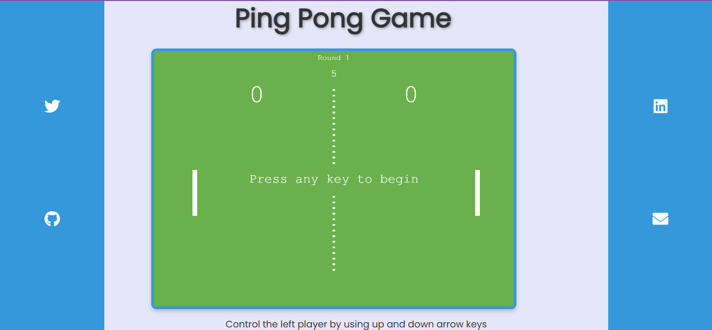

# Ping Pong Game
This is a **mini project** created while practicing JavaScript. The project implements a simple version of the classic Ping Pong game with a focus on functionality rather than design. The user can control the paddle using the arrow keys on their PC to play against an AI opponent.

## Features
- Simple yet functional Ping Pong game mechanics.
- Control the paddle with the **Up** and **Down** arrow keys.
- AI opponent to compete against.
- Minimalist design for simplicity and focus on core functionality.
- Responsive canvas for gameplay.

## Project Structure
- `index.html` - The main HTML file that hosts the game canvas.
- `style.css` - The CSS file for basic styling and layout.
- `app.js` - The JavaScript logic for the game, including player controls, AI, and ball mechanics.

## How to Play
1. Open the project in a browser by hosting it locally or through a live server.
2. Use the **Up** and **Down** arrow keys to control the paddle on the left.
3. Compete against the AI by preventing the ball from reaching your side.

## Demo
You can control the game with your keyboard and enjoy a simple game of Ping Pong. No extra designs, just pure gameplay!

## Credits
- Developed by **[Varun Hotani](https://github.com/Varun5711)**.
- Icons by [Font Awesome](https://fontawesome.com/).
- Fonts by [Google Fonts](https://fonts.google.com/specimen/Poppins).

## Contact
Feel free to reach out for suggestions or feedback:
- [LinkedIn](https://www.linkedin.com/in/varun-hotani-51b046300/)
- [Twitter](https://x.com/devbyVarun)
- Email: varunhotani@gmail.com
